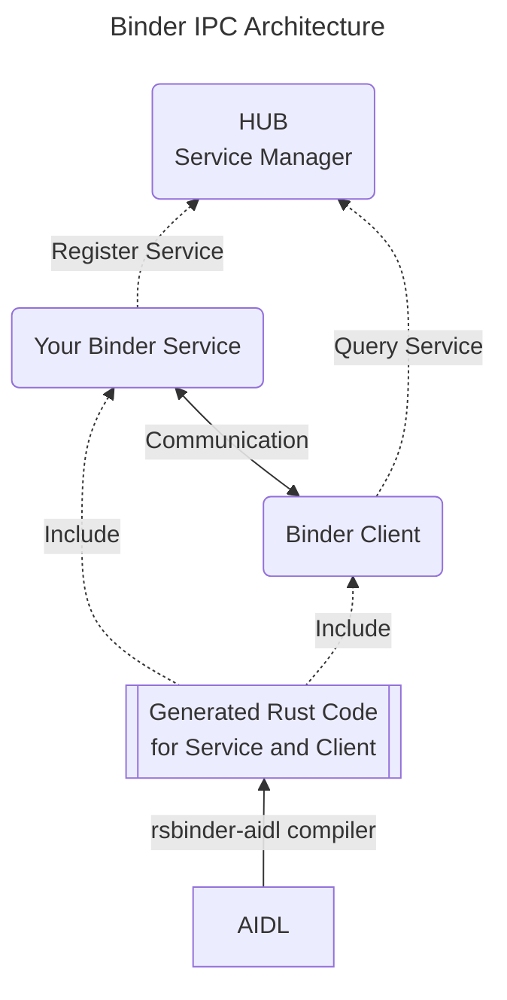

# Architecture

### Description of each component of the diagram
- **AIDL (Android Interface Definition Language)**
    - The Android Interface Definition Language (AIDL) is a tool that lets users abstract away IPC. Given an interface (specified in a .aidl file), the **rsbinder-aidl** compiler constructs Rust bindings so that this interface can be used across processes, regardless of the runtime or bitness.
    - The compiler generates both synchronous and asynchronous Rust code with full type safety.
    - [https://source.android.com/docs/core/architecture/aidl](https://source.android.com/docs/core/architecture/aidl)

- **Generated Rust Code**
    - **rsbinder-aidl** generates trait definitions, proxy implementations (Bp*), and native service stubs (Bn*).
    - Includes Parcelable implementations for data serialization/deserialization.
    - Supports both sync and async programming models with async-trait integration.
    - Features automatic memory management and error handling.

- **Your Binder Service**
    - Implement the generated trait interface to create your service logic.
    - Use BnServiceName::new_binder() to create a binder service instance.
    - Register your service with the HUB using hub::add_service().
    - Join the thread pool to handle incoming client requests.
    - Supports both native services and async services with runtime integration.

- **Binder Client**
    - Use hub::get_interface() to obtain a strongly-typed proxy to the service.
    - The generated proxy code handles all IPC marshalling/unmarshalling automatically.
    - Supports death notifications for service lifecycle management.
    - Can register service callbacks for service availability notifications.
    - Full type safety with compile-time interface validation.

- **HUB (Service Manager)**
    - **rsbinder** provides **rsb_hub**, a service manager for Linux environments.
    - Handles service registration, discovery, and lifecycle management.
    - Provides APIs for listing services, checking service status, and notifications.
    - On Android, integrates with the existing Android service manager seamlessly.
    - Supports priority-based service access and security policies.

