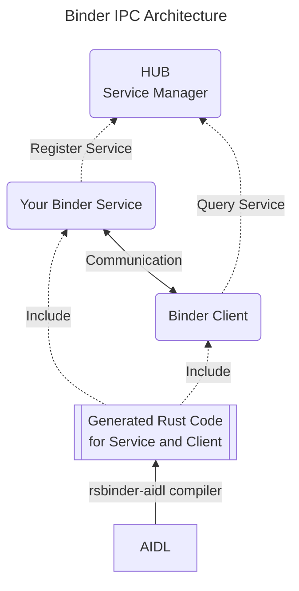

# Architecture


```mermaid
---
title: Binder IPC Architecture
---
flowchart BT
    AIDL
    G[[Generated Rust Code
    for Service and Client]]
    S(Your Binder Service)
    C(Binder Client)
    H(HUB
    Service Manager)

    AIDL-->|rsbinder-aidl compiler|G;
    G-.->|Include|S;
    G-.->|Include|C;
    S-.->|Register Service|H;
    C-.->|Query Service|H;
    C<-->|Communication|S;
```

### How It Works

1. You define your service interface in an **AIDL** file
2. The **rsbinder-aidl** compiler generates Rust code (traits, proxies, and stubs)
3. Your **Service** implements the generated trait and registers itself with the **HUB** (service manager)
4. A **Client** queries the HUB to discover the service, then communicates with it through the generated proxy

### Description of each component of the diagram
- **AIDL (Android Interface Definition Language)**
    - The Android Interface Definition Language (AIDL) is a tool that lets users abstract away IPC. Given an interface (specified in a .aidl file), the **rsbinder-aidl** compiler constructs Rust bindings so that this interface can be used across processes, regardless of the runtime or bitness.
    - The compiler generates both synchronous and asynchronous Rust code with full type safety.
    - [https://source.android.com/docs/core/architecture/aidl](https://source.android.com/docs/core/architecture/aidl)

- **Generated Rust Code**
    - **rsbinder-aidl** generates trait definitions, proxy implementations (Bp*), and native service stubs (Bn*).
    - Includes Parcelable implementations for data serialization/deserialization.
    - Supports both sync and async programming models with async-trait integration.
    - Features automatic memory management and error handling.

- **Your Binder Service**
    - Implement the generated trait interface to create your service logic.
    - Use BnServiceName::new_binder() to create a binder service instance.
    - Register your service with the HUB using hub::add_service().
    - Join the thread pool to handle incoming client requests.
    - Supports both native services and async services with runtime integration.

- **Binder Client**
    - Use hub::get_interface() to obtain a strongly-typed proxy to the service.
    - The generated proxy code handles all IPC marshalling/unmarshalling automatically.
    - Supports death notifications for service lifecycle management.
    - Can register service callbacks for service availability notifications.
    - Full type safety with compile-time interface validation.

- **HUB (Service Manager)**
    - In **rsbinder**, the service manager is referred to as **HUB**. The `hub` module in the rsbinder API provides a unified interface (`hub::add_service()`, `hub::get_interface()`, etc.) that works on both platforms.
    - **On Linux**: **rsbinder** provides **rsb_hub**, a standalone service manager that you run as a separate process. You must start `rsb_hub` before registering or discovering services.
    - **On Android**: The system already provides its own service manager (`servicemanager`). **rsbinder** connects to it automatically — no need to run `rsb_hub`.
    - Handles service registration, discovery, and lifecycle management.
    - Provides APIs for listing services, checking service status, and notifications.

## The RPC transport (a separate, opt-in stack)

The diagram above describes the **kernel binder** path. rsbinder also
ships a second, independent stack — **RPC transport** — that delivers
the same generated AIDL stubs over a socket instead of the kernel
binder driver:

```text
   ┌──────────┐       AIDL stub        ┌──────────┐
   │  Client  │ ─── try_from(root) ──▶ │  Server  │
   └────┬─────┘                        └────┬─────┘
        │                                   │
   RpcSession                          RpcServer
   .setup_unix_client()           .setup_unix_server(path)
   .get_root()                    .set_root(BnFoo)
        │                                   │
        └──── UDS / vsock / TLS socket ─────┘
```

Key contrasts with the kernel-binder diagram:

- **No service manager.** The server publishes a single *root* binder
  via `RpcServer::set_root`; clients fetch it through
  `RpcSession::get_root`. (Multiple named services on one server are
  available via `RpcServer::add_service`.)
- **No kernel driver.** `ProcessState`, `rsb_hub`, and
  `/dev/binderfs/binder` are not involved at all. A pure-RPC process
  needs none of them.
- **Cross-host / cross-VM by design.** Sockets reach further than
  `/dev/binder` does — Linux ↔ macOS, host ↔ VM (vsock), or
  authenticated peers across a network (TLS).

Both stacks coexist in the same process — for example, the **Accessor**
pattern (Android 16+) publishes an `IAccessor` binder over kernel
binder whose `addConnection()` hands the client a connected RPC
socket fd.

See [RPC Transport](./rpc-transport.md) for the full story.
