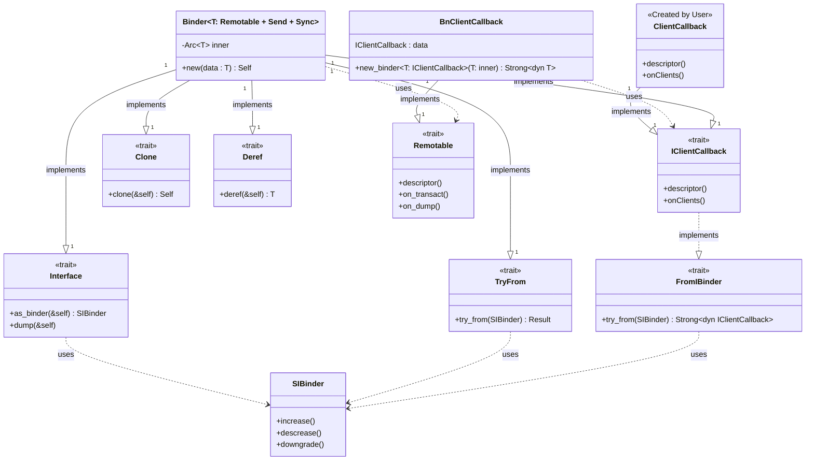
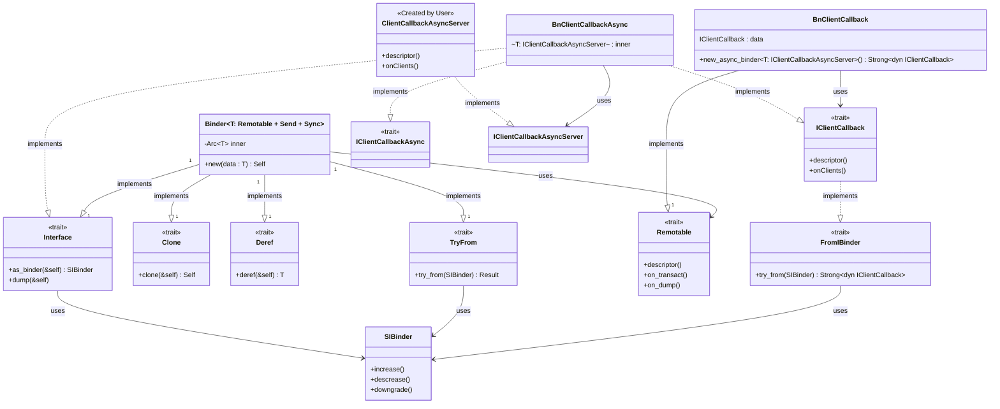

```mermaid
classDiagram
    class Binder~T: Remotable + Send + Sync~ {
        -Arc~T~ inner
        +new(data : T) Self
    }

    Binder "1" --|> "1" Interface : implements
    Binder "1" --|> "1" IClientCallback : implements
    class Interface {
        <<trait>>
        +as_binder(&self) SIBinder
        +dump(&self)
    }

    class SIBinder {
        +increase()
        +descrease()
        +downgrade()
    }

    Binder "1" --|> "1" Clone : implements
    class Clone {
        <<trait>>
        +clone(&self) Self
    }
    Binder "1" --|> "1" Deref : implements
    class Deref {
        <<trait>>
        +deref(&self) T
    }
    Binder "1" --|> "1" TryFrom : implements
    class TryFrom~SIBinder~ {
        <<trait>>
        +try_from(SIBinder) Result<Self>
    }
    class IClientCallback {
        <<trait>>
        +descriptor()
        +onClients()
    }
    class BnClientCallback {
        IClientCallback : data
        +new_binder~T: IClientCallback~(T: inner) Strong~dyn T~
    }
    Binder ..> Remotable : uses
    BnClientCallback "1" --|> "1" Remotable : implements
    class Remotable {
        <<trait>>
        +descriptor()
        +on_transact()
        +on_dump()
    }
    BnClientCallback ..> IClientCallback : uses
    ClientCallback "1" --|> "1" IClientCallback : implements
    class ClientCallback {
        <<Created by User>>
        +descriptor()
        +onClients()
    }
    class FromIBinder {
        <<trait>>
        +try_from(SIBinder) Strong~dyn IClientCallback~
    }
    IClientCallback ..|> FromIBinder : implements
    FromIBinder ..> SIBinder : uses
    TryFrom ..> SIBinder : uses
    Interface ..> SIBinder : uses

```

```mermaid
classDiagram
    class Binder~T: Remotable + Send + Sync~ {
        -Arc~T~ inner
        +new(data : T) Self
    }

    Binder "1" --|> "1" Interface : implements
    class Interface {
        <<trait>>
        +as_binder(&self) SIBinder
        +dump(&self)
    }

    Binder "1" --|> "1" Clone : implements
    class Clone {
        <<trait>>
        +clone(&self) Self
    }
    Binder "1" --|> "1" Deref : implements
    class Deref {
        <<trait>>
        +deref(&self) T
    }
    Binder "1" --|> "1" TryFrom : implements
    class TryFrom~SIBinder~ {
        <<trait>>
        +try_from(SIBinder) Result<Self>
    }
    class IClientCallback {
        <<trait>>
        +descriptor()
        +onClients()
    }
    class BnClientCallback {
        IClientCallback : data
        +new_async_binder~T: IClientCallbackAsyncServer~() Strong~dyn IClientCallback~
    }
    Binder --> Remotable : uses
    BnClientCallback "1" --|> "1" Remotable : implements
    class Remotable {
        <<trait>>
        +descriptor()
        +on_transact()
        +on_dump()
    }
    BnClientCallback --> IClientCallback : uses
    class IClientCallbackAsync {
        <<trait>>
    }
    class BnClientCallbackAsync {
        ~T: IClientCallbackAsyncServer~ : inner
    }
    BnClientCallbackAsync ..|> Interface : implements
    BnClientCallbackAsync ..|> IClientCallback : implements
    BnClientCallbackAsync ..|> IClientCallbackAsync : implements
    BnClientCallbackAsync --> IClientCallbackAsyncServer : uses
    class ClientCallbackAsyncServer {
        <<Created by User>>
        +descriptor()
        +onClients()
    }
    ClientCallbackAsyncServer ..|> IClientCallbackAsyncServer : implements
    class FromIBinder {
        <<trait>>
        +try_from(SIBinder) Strong~dyn IClientCallback~
    }
    IClientCallback ..|> FromIBinder : implements
    FromIBinder --> SIBinder : uses
    TryFrom --> SIBinder : uses
    Interface --> SIBinder : uses
    class SIBinder {
        +increase()
        +descrease()
        +downgrade()
    }

```